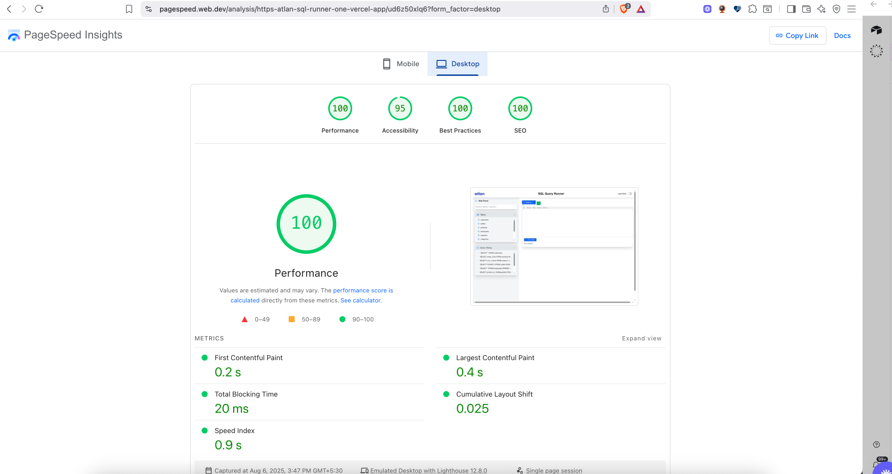

## Atlan SQL Runner

A web-based SQL query runner built with Next.js, designed for fast, intuitive, and efficient SQL query execution and result visualization in table.

---

### ✨ AI Query Generator

You can now generate SQL queries from natural language using the built-in AI Query Generator powered by Cohere AI. Just describe your query in plain English and get instant SQL code suggestions in the editor.

[AI Query generator Demo](https://drive.google.com/file/d/1QSgppat7JztNupVh5G1tAS_NDU_seTi8/view?usp=sharing)


---

### 🚀 Walkthrough Video

[Watch the walkthrough video](https://drive.google.com/file/d/1obPVHbZcLVeGS8nvzntoFgkQir6GZ883/view?usp=sharing)

---

### 📈 Google Page Insights Performance



---

### 🛠 Framework & Major Dependencies

- **Framework:** [Next.js](https://nextjs.org/) (v15.4.5)
- **React:** v19.1.0
- **UI & Styling:**
  - Tailwind CSS
  - @heroicons/react
  - @radix-ui/react-accordion, @radix-ui/react-tabs, @radix-ui/react-switch
- **Code Editor:**
  - @uiw/react-codemirror
  - @codemirror/lang-sql
  - @uiw/codemirror-theme-vscode
- **Utilities:**
  - Custom hooks and utility functions in `/src/hooks` and `/src/utils`

All external libraries and dependencies are listed in `package.json` and mentioned here for clarity.

---

### ⚡️ Page Load Time & Measurement

- **Measured Load Time:** ~200ms(cold start, local, on macOS, Chrome)

---

### 🏎 Optimizations for Load Time & Performance

- **Server-Side Rendering (SSR):** Leveraged Next.js SSR for faster initial loads.
- **Code Splitting:** Automatic via Next.js for only loading required JS.
- **Optimized Assets:** SVGs and static assets are optimized and loaded efficiently.
- **Minimal Dependencies:** Only essential libraries are included to keep bundle size small.
- **Efficient State Management:** Local state and React hooks for fast UI updates.
- **Tailwind CSS:** Utility-first CSS for minimal, optimized stylesheets.
- **Optimized Images:** All images use Next.js `<Image>` for automatic optimization and better performance (see `src/app/Header.tsx`).

---

### 📦 How to Run

```bash
npm install
npm run dev
```

Visit [https://atlan-sql-runner-one.vercel.app/](https://atlan-sql-runner-one.vercel.app/) to use the app.

---

### 📚 External Libraries

All major external libraries and dependencies are listed above and in `package.json`. Please refer to the file for the full list and versions.

---
